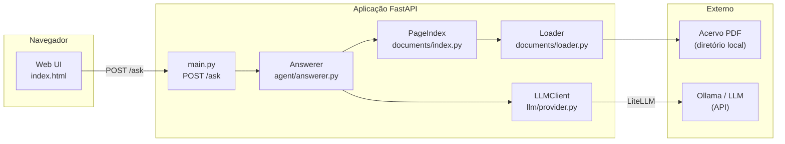
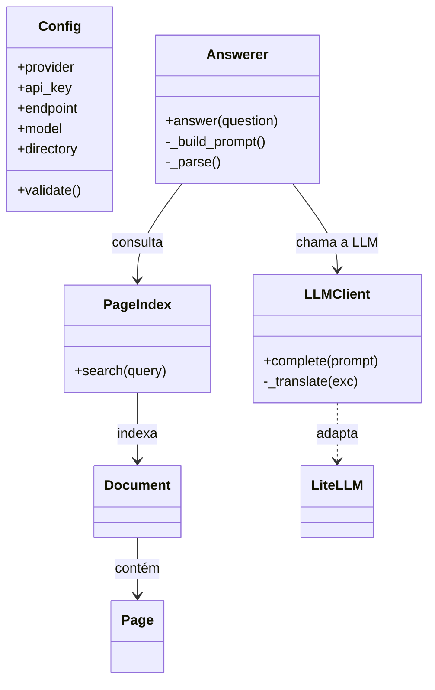

# Curupira

> Agente de IA para pesquisa semântica em acervos locais de artigos científicos (PDF).

[]()
[](./LICENSE)
[]()

## AGL11091 - Tendências Em Engenharia De Software - Turma U (26/2)

Aula - Spec Driven Development

---

## O que é

O **Curupira** é um agente de IA que responde perguntas em linguagem natural sobre um
acervo local de artigos científicos em PDF, com respostas fundamentadas em evidência
(arquivo + página + trecho + relevância + citação). Ele:

- é **restrito ao diretório local** informado — não busca na Internet nem baixa artigos;
- é **independente de provedor de LLM** — configurável via `provider`, chave, endpoint e modelo;
- **não inventa** arquivos, páginas ou citações — separa o que está nos artigos da síntese da IA.

## Como usar

### Pré-requisitos

- Python 3.11+
- Uma LLM acessível por API (ex.: [Ollama](https://ollama.com) local ou um provider na nuvem)
- Um diretório com artigos científicos em PDF

### Configuração do ambiente

Crie um ambiente virtual e instale as dependências.

**Windows (PowerShell):**

```powershell
python -m venv .venv
.\.venv\Scripts\Activate.ps1
python -m pip install --upgrade pip
pip install -r requirements.txt
```

**macOS / Linux:**

```bash
python -m venv .venv
source .venv/bin/activate
pip install --upgrade pip
pip install -r requirements.txt
```

### Inicialização

Informe a configuração da LLM e o diretório do acervo:

```powershell
python -m src.main `
  --provider ollama `
  --api-key "<sua-chave>" `
  --endpoint http://localhost:11434 `
  --model deepseek-v4-pro:cloud `
  --directory "C:\caminho\para\seus\artigos"
```

> Alternativamente, use variáveis de ambiente (`CURUPIRA_PROVIDER`, `CURUPIRA_API_KEY`,
> `CURUPIRA_ENDPOINT`, `CURUPIRA_MODEL`, `CURUPIRA_DIRECTORY`) e rode apenas
> `python -m src.main`.

### Acesso

Abra `http://localhost:8000` no navegador e faça uma pergunta.

### Testes

```bash
pytest
```

## Exemplos de uso

Ao abrir o serviço, você vê uma caixa de texto. Digite uma pergunta, por exemplo:

> Quais artigos discutem metodologias ou ontologias?

O agente examina o acervo e devolve uma resposta como esta:

```text
Encontrei 2 artigos potencialmente relevantes.

1. Modelagem Ontológica para Gestão de Soluções Nutritivas.pdf
   - Página: 2
   - Relevância: discute o desenvolvimento de uma ontologia de domínio.
   - Trecho: "este trabalho propõe o desenvolvimento de uma ontologia..."

2. 14_NeonMethodology.pdf
   - Página: 1
   - Relevância: apresenta a metodologia NeOn para engenharia de ontologias.
```

Cada resultado informa o **arquivo**, a **página**, o **trecho** e a **justificativa**
de relevância. A resposta ainda separa:

- **Presente nos artigos** — o que está efetivamente escrito nos PDFs;
- **Interpretação da IA** — a síntese/interpretação produzida pelo modelo.

Quando o agente **não encontra evidência suficiente**, ele diz isso explicitamente
(em vez de inventar) e, se houver, lista correspondências parciais marcadas como
**baixa confiança**.

Se a **LLM falhar** (chave inválida, indisponível, limite de uso...), a interface mostra
uma mensagem específica para cada tipo de falha.

## Documentação técnica

> Para quem conhece pouco de Python: esta seção acompanha o que acontece no código
> quando o usuário faz a pergunta *"Quais artigos discutem metodologias ou ontologias?"*,
> como se estivéssemos depurando passo a passo.

### Antes de tudo: a inicialização (uma única vez)

Ao subir o serviço, `src/main.py` monta o "cérebro" do agente:

1. **`src/config.py`** — guarda a configuração (`provider`, `api_key`, `endpoint`, `model`,
   `directory`) e a valida (ex.: o diretório existe?).
2. **`src/documents/loader.py`** — `load_acervo(directory)` varre o diretório
   recursivamente (`rglob("*.pdf")`), abre cada PDF e extrai o texto **página por página**
   (via PyMuPDF). Cada página vira um objeto `Page` com `number` e `text`.
3. **`src/documents/index.py`** — `PageIndex(documents)` monta um índice em memória,
   guardando, para cada página, o conjunto de palavras (tokens) que ela contém.
4. **`src/llm/provider.py`** — `LLMClient` é o "tradutor" que fala com a LLM através do
   LiteLLM, aceitando qualquer provider.
5. **`src/agent/answerer.py`** — `Answerer(index, llm)` reúne tudo: dado um `index` e um
   `llm`, sabe responder.

### Passo a passo da pergunta

Quando o usuário digita a pergunta na interface (`src/web/static/index.html`), o
navegador faz um `POST /ask` com `{"question": "..."}`. Veja o fluxo:

1. **`src/main.py` — `POST /ask`**
   Recebe a pergunta, valida que não está vazia e chama `answerer.answer(question)`.

2. **`src/agent/answerer.py` — `answer(question)`**
   Primeiro pede ao índice as páginas mais relevantes:

   ```python
   pages = self.index.search(question, top_k=10)
   ```

3. **`src/documents/index.py` — `search(query)`**
   - `tokenize(query)` quebra a pergunta em palavras normalizadas: `["quais", "artigos",
     "discutem", "metodologias", "ou", "ontologias"]`.
   - Para cada página do acervo, calcula a **sobreposição** entre as palavras da pergunta
     e as palavras da página.
   - Ordena por pontuação e devolve as 10 páginas mais parecidas.

4. **De volta em `answerer.py`**
   Se nenhuma página casou, o agente responde "sem evidência" (não inventa). Caso
   contrário, monta o prompt com as regras do sistema + os trechos das páginas:

   ```text
   [Arquivo: 14_NeonMethodology.pdf | Página: 1]
   Engenharia de Ontologias: Metodologia NeOn ...
   ```

5. **`src/llm/provider.py` — `complete(prompt)`**
   Chama `litellm.completion(model="ollama/deepseek-v4-pro:cloud", api_base="...", ...)`.
   Se algo falhar, converte o erro em um tipo amigável (`invalid_key`, `rate_limit`,
   `unavailable`...).

6. **De volta em `answerer.py` — `_parse(raw)`**
   Extrai o JSON da resposta da LLM e monta a `Answer`, com `results`, `facts` (o que está
   nos artigos), `interpretation` (a síntese) e `uncertainty`.

7. **`src/main.py`** devolve a `Answer` como JSON, e a interface exibe os resultados.

> **Princípio central (constituição, princípio I):** o agente só usa os trechos fornecidos
> como evidência e é instruído a **nunca inventar** arquivo, página ou citação.

## Arquitetura & Design

### Arquitetura de software



### Design pattern

A aplicação usa uma arquitetura em camadas com **injeção de dependência** e um **adapter**
para o provedor de LLM:



- **`LLMClient`** é um **Adapter/Facade**: esconde as diferenças entre provedores atrás de
  um único método `complete(prompt)`.
- **`Answerer`** é um **orchestrator**: coordena índice + LLM + parsing.
- **`PageIndex` / `Loader`** isolam o acesso aos documentos (separação de responsabilidades).
- **Injeção de dependência**: `build_app()` monta `LLMClient` e `PageIndex` e os passa ao
  `Answerer`, facilitando testes (ex.: `tests/integration/test_ask.py` injeta um stub).

## Licença

[MIT](./LICENSE) © 2026 Andrew Paes.


